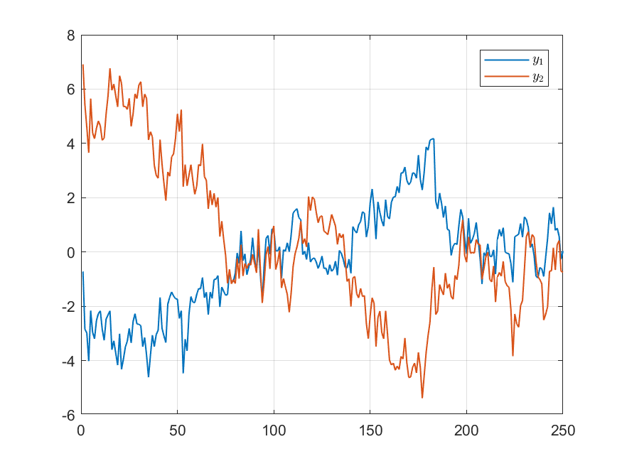
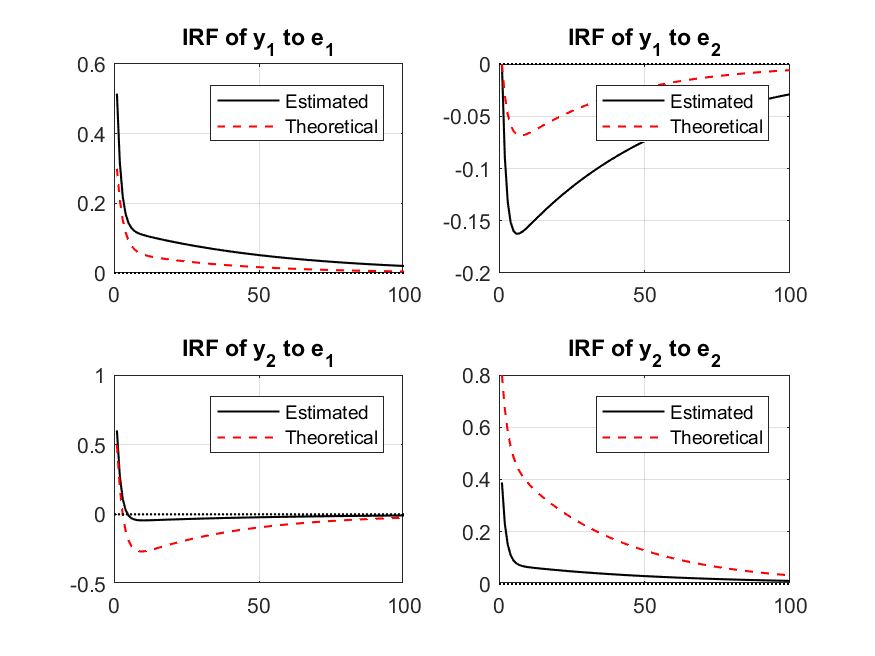

# Time Series toolbox for Matlab&reg;
Matlab code I use to estimate Vector AutoRegressions (VARs).
I'm probably never going to be serious with this code...

## Usage

Download the `var_lib` folder and let Matlab see it.

* `VAR.m`:
  Given a `T x N` dataset, where `T` is the number of observations over time and `N` is the number of variables, this function returns the estimated matrix of coefficients `B` and the estimated variance-covariance matrix `S` for a VAR(_p_) specification.
  If the lag order _p_ of the VAR is higher than 1, then `B` and `S` are the companion form matrices.
* `IRF.m`:
  Given estimated `B` and `S` and an orthogonalization scheme (`short-run` or `long-run`), computes the Impulse-Response Functions (IRFs) for `h` periods ahead.

The other functions in the folder are not supposed to be used directly by the end user.
That is, they are auxiliary functions that do the behind-the-scenes heavy lifting.
In short, they do the necessary matrix manipulation to prepare the dataset for VAR estimation, leveraging the companion form representation.
The only general purpose function is `ols.m`, which is pretty much self-explanatory.

## Development status

* The `IRF` function works for VARs of order 1.
  The function can already deal with lag orders higher than 1 through the companion form, but it does not extract the IRFs in a nice "package".
* The `IRF` function currently supports the `short-run` Cholesky identification scheme only.

### To Do's

* Implement bootstrapping for IRF confidence intervals.
* Generalize and prettify `IRF.m` for lag order _p > 1_.
* Implement the long-run identification scheme in `IRF.m`.
* Code some plotting wrappers for IRF point estimates and confidence intervals.

## Artwork

Artificially generated data with hard-wired short-run Cholesky ordering:

Point estimates for Impulse-Responses:

